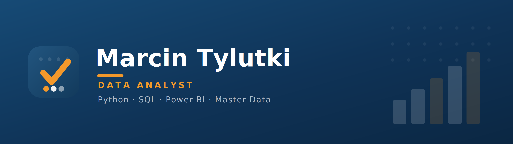

  

  <a href="https://www.linkedin.com/in/<YOUR-LINKEDIN>/">
    
  </a>
  <a href="mailto:<YOUR-EMAIL>">
    
  </a>

---

### Hi, I'm Marcin

I'm a **data analyst**. I like work that starts with a business question and ends
with a clear, data-backed answer — from a raw, messy dataset, through cleaning and
analysis, to a simple visualization that anyone can read.

I mostly work with **Python, SQL, Power Query and Power BI**. I also care about **master data
quality**, because even the best analysis is only as good as the data behind it.

---

### How I approach data

- **Question first, then code.** I start from the question the analysis should
  answer, not from the tool.
- **Measure before you judge.** Profiling and numbers come before conclusions,
  not the other way around.
- **Repeatable, not manual.** I build data cleaning as a process (Power Query /
  pandas) that refreshes with a single click.
- **I don't ship what I don't understand.** I prefer a simpler solution I can
  explain and maintain over a "clever" one that is a black box.

---

### Tools

**Areas:** exploratory data analysis · data cleaning & transformation ·
visualization & dashboards · master data quality · machine learning basics

---

### Projects

**[Master Data Quality — SQL & Power BI dashboard](https://github.com/ds-MarT90/<DQ-REPO-NAME>)** · `MS-SQL` · `Power BI`
End-to-end data quality project covering profiling, SQL-based data quality audits and interactive reporting. Implemented **35 automated quality rules** across **7 data quality dimensions**, built a KPI scorecard and an interactive **Power BI dashboard** with drill-through capabilities.

- Overall data quality score: **97.1%**
- Detected duplicates, invalid values, inconsistent dictionaries and orphan records
- Interactive KPI dashboard with filtering and drill-through
- **Tech:** MS SQL Server, Power BI
- **Future improvements:** Automated Power Query transformations and scheduled data quality monitoring.

**[Loan Approval Prediction](https://github.com/ds-MarT90/loan-approval-prediction)** · `Python` · `scikit-learn`
End-to-end machine learning project following the CRISP-DM methodology. Built a classification model using a dataset of 
**4,269 loan applications**, covering data cleaning, exploratory analysis, feature engineering, model training and evaluation.

- Cleaned and prepared raw data, resolving quality issues such as inconsistent text formatting and missing values.
- Compared Logistic Regression, Decision Tree and Random Forest using Accuracy, Precision, Recall, F1-score and ROC AUC.
- Identified **CIBIL score**, applicant income and loan amount as the most influential predictors.
- **Tech:** Python, pandas, NumPy, scikit-learn, Matplotlib, Seaborn.

**[Nobel Prize Analysis](https://github.com/ds-MarT90/nobel-prize-analysis)** · `Python` · `pandas`
Exploratory data analysis project based on Nobel Prize data from **1901–2023**. The project investigates long-term trends in award distribution across countries, genders and scientific fields using Python and data visualization techniques.

- Analyzed historical trends in Nobel Prize awards across more than 120 years.
- Explored changes in gender representation, birth countries and award categories.
- Built clear visualizations to communicate key findings and historical patterns.
- **Tech:** Python, pandas, Matplotlib, Seaborn.
---

  
  

Open to data analyst opportunities. Feel free to reach out — contact links above.

<!--
**ds-MarT90/ds-MarT90** is a ✨ _special_ ✨ repository because its `README.md` (this file) appears on your GitHub profile.

Here are some ideas to get you started:

- 🔭 I’m currently working on ...
- 🌱 I’m currently learning ...
- 👯 I’m looking to collaborate on ...
- 🤔 I’m looking for help with ...
- 💬 Ask me about ...
- 📫 How to reach me: ...
- 😄 Pronouns: ...
- ⚡ Fun fact: ...
-->
